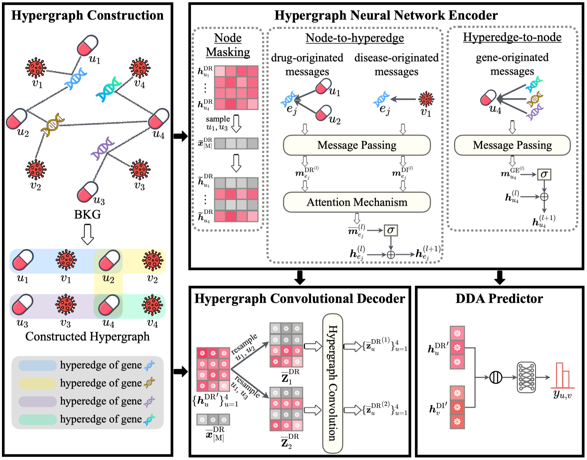

# paper_Hyades
This is the PyTorch implementation for paper "Hypergraph Masked Autoencoder for Drug Repositioning".

## Environment:
The codes are implemented and tested under the following development environment:
-  Python 3.8.19
-  cudatoolkit 11.5
-  pytorch 1.10.0
-  dgl 0.9.1
-  numpy 1.24.3
-  scikit-learn 1.3.0

## Datasets
We verify the effectiveness of our proposed method on three large-scale benchmarks, i.e., PrimeKG, BioKG and DRKG.

These datasets can be downloaded from [google drive](https://drive.google.com/drive/folders/1K7yE0mgQOZsKCcDM-k_rYZFYmKmxWbrZ). Herein, we elaborate on the corresponding data files.
- <i>disease_to_idx.json</i>: The disease name to id mapping file.
- <i>drug_to_idx.json</i>: The drug name to id mapping file.
- <i>gene_to_idx.json</i>: The gene name to id mapping file.
- <i> disease-gene.csv </i>: The known disease-gene associations.
- <i> drug-gene.csv </i>: The known drug-gene associations.
- <i> drug-disease.csv </i>: The known drug-disease associations.

## Code Files:
The introduction of each <code> py </code> file is as follows:
- <i>convE.py</i>: Generates the initial node and hyperedge features.
- <i>dataloader.py</i>: Defines dataset classes and K-fold cross-validation data loaders for drug repositioning.
- <i>hypergraph_data.py</i>: Constructs hypergraph datasets from biomedical knowledge graphs and implements negative sampling strategies for drug-disease pairs.
- <i>main.py</i>: Main entry point that orchestrates the training and evaluation pipeline with proper random seed initialization.
- <i>model_train.py</i>: Implements the training framework including metrics calculation, early stopping mechanism, and model evaluation procedures.
- <i>model.py</i>: Defines the hypergraph masked autoencoder architecture and drug-disease association predictor.
- <i>parse_args.py</i>: Configures command-line argument parsing for hyperparameter settings and experimental configurations.

## How to Run the Code:
Please firstly download the datasets and ConvE embeddings, then unzip the downloaded file. Next, move the unzipped datasets into this folder. The commands to train DiGGS on the OpenBioLink, PrimeKG or BioKG are as follows.

<ul>
<li>OpenBioLink<pre><code>python main.py --dataset = OpenBioLink</code></pre>
</li>
<li>PrimeKG<pre><code>python main.py --dataset = PrimeKG</code></pre>
</li>
<li>BioKG<pre><code>python main.py --dataset = BioKG</code></pre>
</li>
</ul>
</body></html>
